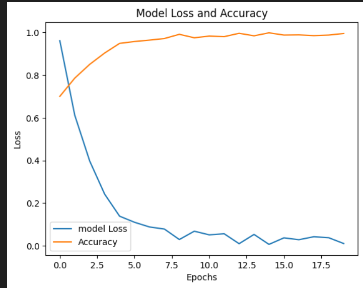

## Dataset
Create small image dataset [cat and dog](https://www.kaggle.com/datasets/shaunthesheep/microsoft-catsvsdogs-dataset)  

## Resourses
network.ipynb containt all codes and its model predict given picture is cat or a Dog. or you can used my pretrain model also('model2.keras').
If you need to re train it please change the path 
`model.save('drive/MyDrive/cat_dog_classification/model2.keras')`
This model made using ResNet50 pre trained weights and I have modified classification only

